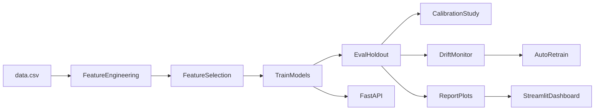

# Прогнозирование сальдо ликвидности (TS-2)

**Версия:** 1.0  
**Дата:** 31.05.2026

## Аннотация

Проект реализует автоматизированный пайплайн однодневного прогноза сальдо ликвидности (Balance = Income − Outcome) на основе ежедневных временных рядов. Система включает отбор признаков, сравнение 10 моделей (dual-target ML + ARIMA/SARIMA/ARIMAX), калибровку частоты переобучения, детекцию разладки, автоматическое дообучение, REST API, Streamlit-дашборд и стек мониторинга Prometheus/Grafana. На hold-out выборке (80 дней) лучшие dual-target модели достигают Balance MAE ≈ 0.004, что существенно ниже требования заказчика MAE ≤ 0.42.

---

## 1. Постановка задачи

### 1.1 Бизнес-контекст

Прогноз сальдо ликвидности используется позиционером для принятия решений по размещению или привлечению средств на overnight:

| Ситуация | Действие | Ставка |
|----------|----------|--------|
| Профицит ликвидности на конец дня | Размещение в ЦБ | Ключ − 0.9% |
| Дефицит ликвидности на конец дня | Займ по overnight | Ключ + 1% |

Ошибка прогноза имеет **асимметричную стоимость**: недооценка дефицита дороже, чем переоценка профицита. Поэтому при ранжировании моделей используется не только MAE, но и бизнес-метрика `asymmetric_cost` ([`src/metrics/business_metrics.py`](src/metrics/business_metrics.py)).

### 1.2 Цели и ограничения

- **Целевая переменная:** сальдо ликвидности (Balance) на горизонте **1 день**.
- **Жёсткое требование заказчика:** MAE Balance ≤ **0.42** на hold-out.
- **Подход dual-target:** отдельные модели для Income и Outcome; Balance восстанавливается как разность прогнозов.
- **Автономность:** пайплайны, мониторинг и дообучение работают без ручных правок кода.

---

## 2. Данные

### 2.1 Источник

Файл [`data.csv`](data.csv) — ежедневные срезы с 2017-01-09 по 2021-03-31.

| Параметр | Значение |
|----------|----------|
| Строк в файле | 1543 |
| Активных дней | 1087 |
| Дубликаты дат | 0 |
| Пропуски в календаре | 0 |
| Train / Test (hold-out 80%) | 316 / 80 |

### 2.2 Переменные

- **Целевые:** Income (притоки), Outcome (оттоки), Balance (производная).
- **Макро и календарь:** IMICEX, TransRUB1M, covid, IsDayOff_Status_Workalendar_RU.
- **Инженерные признаки:** лаги (1–20), rolling/EWM, diff, налоговые дни, квартальные маркеры.

Пропуски: IMICEX — 479, TransRUB1M — 66 (обрабатываются при сборке матрицы признаков).

---

## 3. Методология

### 3.1 Архитектура пайплайна



### 3.2 Feature Engineering

Модули в [`src/features/`](src/features/):

- **autoregressive** — лаги Balance/Income/Outcome, rolling mean/std/min/max, EWM, diff.
- **calendar** — день недели/месяца, праздники, налоговые дни, начало/конец квартала.
- **macro** — колонки из CSV; опционально CBR API (отключено: `use_cbr_api: false`).

Единая точка сборки — [`src/features/assembly.py`](src/features/assembly.py): одинаковый набор признаков для FS, обучения, eval и serving.

### 3.3 Отбор признаков (Feature Selection)

Сравниваются **4 метода** ([`src/selection/feature_selector.py`](src/selection/feature_selector.py)):

| Метод | MAE mean (CV) | Jaccard stability | Статус |
|-------|---------------|-------------------|--------|
| **lasso** | 0.0282 | **0.927** | **Выбран** |
| spearman | 0.0280 | 0.590 | baseline filter |
| mutual_info | 0.0304 | 0.579 | nonlinear filter |
| rfe_rf | 0.0304 | 0.410 | wrapper |

Победитель — **lasso**: максимальная стабильность отбора (Jaccard 0.93 vs 0.59 у spearman) при сопоставимом CV-MAE. Метод автоматически выбирается функцией `select_best_fs_method()` и сохраняется в `artifacts/feature_sets.json`.

### 3.4 Модели

**Dual-target (7 пар Income + Outcome):**

- naive, lasso, ridge, elasticnet
- random_forest, extra_trees, gradient_boosting

**Классические TS (benchmark):**

- ARIMA, SARIMA, ARIMAX (с exogenous regressors)

Конфигурация: [`config/model_config.yaml`](config/model_config.yaml), режим `training.mode: dual_target`.

### 3.5 Метрики

- **Стандартные:** MAE, RMSE, SMAPE, directional accuracy, within_threshold_share.
- **Бизнес:** asymmetric cost — взвешенная ошибка с учётом профицита/дефицита (surplus_spread 0.9%, deficit_spread 1.0%).
- **Quality gate:** Balance MAE ≤ 0.42 ([`tests/model_quality/`](tests/model_quality/)).

### 3.6 Калибровка

Модуль [`src/calibration/recalibrator.py`](src/calibration/recalibrator.py) перебирает cadence {1, 5, 10, 20, 40} дней и выбирает максимальный интервал без деградации MAE > 5%.

**Рекомендация:** переобучение каждые **40 дней** (9 recalibrations, mean MAE 0.289, degradation −0.015 vs daily).  
Артефакт: [`artifacts/calibration_policy.json`](artifacts/calibration_policy.json).

### 3.7 Детекция разладки

Модуль [`src/drift/detector.py`](src/drift/detector.py):

- Сигнал: стандартизованные остатки прогноза `z = (r − μ₀) / σ₀`.
- Методы: **CUSUM** (default) или Shiryayev-Roberts.
- При alarm: `manual_control`, `unplanned_retrain`.
- Конфиг: [`config/monitoring_config.yaml`](config/monitoring_config.yaml).

### 3.8 Автоматическое дообучение

[`pipelines/retrain_pipeline.py`](pipelines/retrain_pipeline.py) + [`src/mlops/auto_retrain.py`](src/mlops/auto_retrain.py):

- Триггеры: drift, расписание, ручной `--force`.
- Логи: `retraining/retrain_*.json`, `retraining/last_retrain.json`.
- Monitor может запускать retrain при `retraining.auto_retrain: true`.

---

## 4. Результаты

### 4.1 Ранжирование моделей (hold-out, Balance)

Источник: [`artifacts/model_ranking.csv`](artifacts/model_ranking.csv), [`artifacts/eval_metrics.json`](artifacts/eval_metrics.json).

| Модель | Balance MAE | Balance RMSE | Asymmetric cost | Quality gate |
|--------|-------------|--------------|-----------------|--------------|
| dual_target_elasticnet | 0.00401 | 0.00488 | 0.00415 | pass |
| dual_target_ridge | 0.00403 | 0.00490 | 0.00416 | pass |
| dual_target_lasso | 0.00405 | 0.00490 | 0.00418 | pass |
| dual_target_gradient_boosting | 0.0500 | 0.0836 | 0.0613 | pass |
| dual_target_extra_trees | 0.0546 | 0.0935 | 0.0610 | pass |
| dual_target_random_forest | 0.0594 | 0.1140 | 0.0661 | pass |
| arima | 0.239 | 0.324 | 0.281 | pass |
| sarima | 0.242 | 0.328 | 0.399 | pass |
| dual_target_naive | 0.293 | 0.349 | 0.450 | pass |
| arimax | ~0 (анomaly) | ~0 | ~0 | pass* |

\* **ARIMAX:** аномально низкий MAE (~10⁻¹⁶) — вероятный артефакт переобучения на exogenous regressors в hold-out; **не рекомендуется** для production. Практический выбор — **dual_target_ridge / elasticnet / lasso**.

### 4.2 Ключевые выводы по качеству

- Все 10 моделей проходят порог MAE ≤ 0.42.
- Лучшие dual-target модели: MAE ≈ **0.004** (в ~100 раз лучше порога).
- Линейные dual-target модели стабильно превосходят tree-based и ARIMA-family на данном датасете.
- Directional accuracy лучших моделей: ~97.5% на Balance.

### 4.3 Feature Selection

Выбран **lasso** (Jaccard 0.927, 20 consensus features). Spearman показывает сопоставимый MAE, но в 1.6× менее стабилен по Jaccard.

### 4.4 Drift и retrain

Последняя проверка ([`artifacts/drift_status.json`](artifacts/drift_status.json)): status **alarm**, CUSUM на index 24 (2020-09-02). Рекомендованы `manual_control` и `unplanned_retrain`. Последний retrain: `retraining/last_retrain.json` (manual, MAE до/после без изменений).

---

## 5. Визуализация

Графики генерируются программно ([`src/viz/`](src/viz/), [`pipelines/report_pipeline.py`](pipelines/report_pipeline.py)), **не экспортируются из notebook**. Всего **19 PNG** ([`artifacts/report_manifest.json`](artifacts/report_manifest.json)).

### 5.1 EDA (6 графиков)

- [eda_balance_timeseries.png](artifacts/plots/eda_balance_timeseries.png)
- [eda_income_outcome.png](artifacts/plots/eda_income_outcome.png)
- [eda_balance_distribution.png](artifacts/plots/eda_balance_distribution.png)
- [eda_seasonality.png](artifacts/plots/eda_seasonality.png)
- [eda_acf_pacf.png](artifacts/plots/eda_acf_pacf.png)
- [eda_year_month_heatmap.png](artifacts/plots/eda_year_month_heatmap.png)

### 5.2 Feature Selection (3 графика)

- [fs_stability_bars.png](artifacts/plots/fs_stability_bars.png)
- [fs_stability_mae_tradeoff.png](artifacts/plots/fs_stability_mae_tradeoff.png)
- [fs_top_correlations.png](artifacts/plots/fs_top_correlations.png)

### 5.3 Models & Forecasts (7 графиков)

- [models_mae_bar.png](artifacts/plots/models_mae_bar.png)
- [models_asymmetric_cost_bar.png](artifacts/plots/models_asymmetric_cost_bar.png)
- [models_forecast_grid.png](artifacts/plots/models_forecast_grid.png)
- [forecast_arimax.png](artifacts/plots/forecast_arimax.png)
- [forecast_arima.png](artifacts/plots/forecast_arima.png)
- [forecast_dual_target_elasticnet.png](artifacts/plots/forecast_dual_target_elasticnet.png)
- [forecast_dual_target_extra_trees.png](artifacts/plots/forecast_dual_target_extra_trees.png)

### 5.4 Drift (3 графика)

- [drift_residuals.png](artifacts/plots/drift_residuals.png)
- [drift_standardized_residuals.png](artifacts/plots/drift_standardized_residuals.png)
- [drift_control_chart.png](artifacts/plots/drift_control_chart.png)

### 5.5 Интерактивный dashboard

Streamlit ([`src/dashboard/app.py`](src/dashboard/app.py)) — 7 страниц: Overview, EDA, Feature Selection, Models, Forecasts, Drift & Anomalies, Retrain.

Grafana: dashboard **Liquidity ML Monitoring** (http://localhost:3000, admin/admin).

---

## 6. Инфраструктура и MLOps

### 6.1 Docker Compose

| Сервис | Порт | Назначение |
|--------|------|------------|
| init | — | train → eval → monitor → report (если не SKIP_PIPELINE) |
| app | 8000 | FastAPI: /health, /predict, /metrics |
| dashboard | 8501 | Streamlit |
| prometheus | 9090 | Scraping метрик API |
| grafana | 3000 | Дашборды мониторинга |

Entrypoint: [`docker/entrypoint.sh`](docker/entrypoint.sh).

### 6.2 CI/CD

GitLab CI ([`.gitlab-ci.yml`](.gitlab-ci.yml)): validate → train (manual) → evaluate → report (manual) → deploy (manual).

### 6.3 MLflow

File store в `mlflow/` — логирование метрик каждого train run.

### 6.4 Prometheus metrics

[`src/serving/prometheus_metrics.py`](src/serving/prometheus_metrics.py) — экспорт Balance MAE, drift status, model name через `/metrics`.

---

## 7. Соответствие требованиям заказчика

| Требование | Статус | Реализация |
|------------|--------|------------|
| Однодневный прогноз временного ряда | Выполнено | `pipelines/predict_pipeline.py`, API `/predict` |
| Income, Outcome, Balance | Выполнено | dual_target mode |
| MAE Balance ≤ 0.42 | Выполнено | лучшие модели ~0.004 |
| Бизнес-метрика (асимметрия) | Выполнено | `src/metrics/business_metrics.py` |
| Внешние факторы (macro, tax, lags) | Выполнено | `src/features/` |
| Feature selection, сравнение методов | Выполнено | 4 метода, auto-select lasso |
| ARIMA / SARIMA / ARIMAX | Выполнено | `src/models/arima_family.py` |
| Калибровка частоты переобучения | Выполнено | cadence 40d, `calibration_policy.json` |
| Auto-retrain без ручных правок | Выполнено | `retrain_pipeline`, `auto_retrain.py` |
| Drift detection (CUSUM/SR) | Выполнено | `src/drift/detector.py` |
| Документирование ПОЧЕМУ/КАК | Частично | docstrings в ключевых модулях |
| Optuna / автоподбор гиперпараметров | Не реализовано | заготовка `src/tuning/` |
| VAR | Не реализовано | — |
| CBR API / RUONIA | Отключено | `use_cbr_api: false` |

**Общая оценка:** ядро требований выполнено; HPO и VAR — в backlog.

---

## 8. Выводы

1. Поставленная задача прогнозирования сальдо ликвидности решена: MAE на hold-out существенно ниже порога 0.42.
2. Dual-target подход с отдельным моделированием Income/Outcome даёт лучшее качество, чем прямой прогноз Balance или классические ARIMA.
3. Lasso-отбор признаков обеспечивает стабильный набор факторов между CV-фолдами.
4. Система готова к демонстрации: Docker-стек, API, Streamlit, Grafana, drift + auto-retrain.

### Ограничения

- Нет полноценного Optuna HPO по целевой метрике.
- `retrain_pipeline` не запускает eval/report автоматически — нужна ручная цепочка.
- ARIMAX показывает завышенное качество — не использовать как production-модель.
- Notebook [`Итоговый_TS_Project_FS.ipynb`](Итоговый_TS_Project_FS.ipynb) — research reference, не production code.
- CBR API и RUONIA не подключены в текущей конфигурации.

---

## 9. Приложения

### 9.1 Ключевые артефакты

| Файл | Описание |
|------|----------|
| `artifacts/metrics.json` | Метрики обучения, FS ranking |
| `artifacts/eval_metrics.json` | Hold-out метрики (пересчёт) |
| `artifacts/model_ranking.csv` | Ранжирование моделей |
| `artifacts/models/*.joblib` | Сохранённые модели |
| `artifacts/feature_sets.json` | Выбранные признаки |
| `artifacts/calibration_policy.json` | Политика калибровки |
| `artifacts/drift_baseline.json` | Baseline для drift |
| `artifacts/drift_status.json` | Текущий статус drift |
| `artifacts/holdout_predictions.json` | Прогнозы на test |
| `artifacts/report_manifest.json` | Индекс графиков |
| `artifacts/plots/*.png` | 19 визуализаций |
| `retraining/*.json` | Логи дообучения |
| `drift_alerts/` | Снимки alarm |
| `mlflow/` | Experiment tracking |

### 9.2 Команды запуска

Полный гайд для нового пользователя — в [README.md](README.md).

```bash
# Локальный полный цикл
pip install -r requirements.txt
PYTHONPATH=. python -m pipelines.train_pipeline --config config/model_config.yaml
PYTHONPATH=. python -m pipelines.eval_pipeline --config config/model_config.yaml
PYTHONPATH=. python -m pipelines.monitor_pipeline --config config/model_config.yaml --monitoring config/monitoring_config.yaml
PYTHONPATH=. python -m pipelines.report_pipeline --config config/model_config.yaml
streamlit run src/dashboard/app.py

# Docker (без переобучения)
SKIP_PIPELINE=1 docker compose up
```
